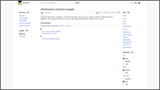
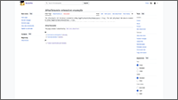

# Attachments for MediaWiki 1.42

Attachments is a MediaWiki extension to attach files and external links to pages.

> ❤️ **This extension was originally developed and maintained by [Gittenburg](https://github.com/Gittenburg).**
>
> Please review the new configuration options when migrating from the old repository. The default behavior has been changed to accommodate modern skins.

## Screenshots

Example of the Attachments extension. Left: default configuration. Right: with `$wgAttachmentsShowInNamespaces` and `$wgAttachmentsShowInViews` set to `true`.

[](assets/attachments-default.png) [](assets/attachments-config.png)

## Usage

- [Subpages](https://www.mediawiki.org/wiki/Help:Subpages) are automatically attached to their parent page.
- Files can be attached to a page by setting `{{#attach: pagename}}` in the file description.
- External links can be defined as subpages containing `{{#exturl: URL}}`.

For enabled namespaces the attachments of an article are displayed in an automatically generated section at its end. To facilitate adding attachments an `attach` page action is provided, which is linked in the Vector and Minerva skins.

Some more usage tips:

- `#attach` also works on regular articles.
- You can link files added through `action=attach` relatively with `[[File:{{FILEPREFIX}}filename.jpg]]` (or `{{FILEPREFIX:..}}` for the parent page).
- Enable [$wgCountCategorizedImagesAsUsed](https://www.mediawiki.org/wiki/Manual:$wgCountCategorizedImagesAsUsed) to exclude attached files from `Special:UnusedImages`.
- You can exclude subpages starting with a specific prefix from the auto-index with `{{#attachments ignore subpages: prefix}}` on the parent page.
- Attachments and external URLs are both stored as [page props](https://www.mediawiki.org/wiki/Manual:Page_props_table), meaning they can be queried with [API:Pageprops](https://www.mediawiki.org/wiki/API:Pageprops) and [API:Pageswithprop](https://www.mediawiki.org/wiki/API:Pageswithprop).
- You can access attachments before they are sorted with the `BeforeSortAttachments(&$links)` hook, where links is an associative array mapping string keys to HTML links. Return false to take over the sorting.
- If new attachments do not show up, it might be because you have many jobs in your [job queue](https://www.mediawiki.org/wiki/Manual:Job_queue).

## Installation

Clone the extension into your MediaWiki `extensions` directory:

```bash
cd extensions/
git clone --branch REL1_42 https://github.com/vuhuy/Attachments
```

Then enable it by adding the following lines to your `LocalSettings.php`:

```php
wfLoadExtension( 'Attachments' );
```

This extension is enabled for the main namespace by default. You might want to enable the extension for other namespaces, e.g.:

```php
$wgAttachmentsNamespaces[NS_MAIN] = true;
```

Note that you should also [enable subpages](https://www.mediawiki.org/wiki/Manual:LocalSettings.php#Enabling_subpages) for these namespaces, e.g.:

```php
$wgNamespacesWithSubpages[NS_MAIN] = 1;
```

File uploads must be [enabled and configured](https://www.mediawiki.org/wiki/Manual:Configuring_file_uploads) in order to attach files to a page.

Optional configuration parameters:

- `$wgAttachmentsChunkListByLetter` (boolean)  
  Whether or not the attachment list should be chunked by the first letter of list items. Defaults to `true`.
- `$wgAttachmentsShowSubpageForm` (boolean)  
  Whether or not the subpage form should be shown. Defaults to `true`.
- `$wgAttachmentsShowLinkForm` (boolean)  
  Whether or not the external link form should be shown. Defaults to `true`.
- `$wgAttachmentsShowInNamespaces` (boolean)  
  Whether or not a link to the attachments should be shown in the namespaces (page, discussion). Defaults to `false`.
- `$wgAttachmentsShowInViews` (boolean)  
  Whether or not an 'add attachments' link should be shown in the views (read, edit source, view history). Defaults to `false`.
- `$wgAttachmentsShowEmptySection` (boolean)  
  Whether or not to show certain elements when there are no attachments for a page. Defaults to `false`.

## Credits

This extension is essentially a rewrite of PerPageResources by Mathias Ertl, which consists of [Extension:Resources](https://fs.fsinf.at/wiki/Resources), [Extension:AddResource](https://fs.fsinf.at/wiki/AddResource), and [Extension:ExternalRedirects](https://github.com/mathiasertl/ExternalRedirects). This extension replaces all three. Notable differences are:

* Attachments are stored in page\_props instead of pagelinks.
* No open redirects, just links.
* Attachments are shown at the end of pages, as opposed to on a special page.

Originally developed and maintained by [Gittenburg](https://github.com/Gittenburg).

The icons in `resources/` are from [Feather](https://feathericons.com/) and licensed under MIT.
